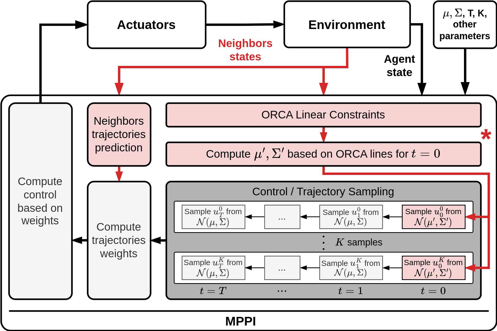

# Model Predictive Path Integral for Multi-Agent Collision Avoidance

## Decrtiption
<p align="center">
  
</p>


Implementation of distributed multi-agent collision avoidance algorithm based on the seminal sampling-based model predictive control algorithm, i.e., _MPPI_ [[1]()], that originally solves a single-agent problem. We enhance it by introducing safe distributions for the multi-agent setting that are derived from the _Optimal Reciprocal Collision Avoidance (ORCA)_ linear constraints [[2]()], an established approach from the multi-agent navigation domain. 


This is supplementary code for paper "Model Predictive Path Integral for Decentralized Multi-Agent Collision Avoidance" which is under consideration in the PeerJ Computer Science journal. 


The pipeline of the proposed algorithm is presented on picture below. The red elements on scheme demonstrate the components that were added to MPPI procedure to adapt in for decentralized multi-agent scenario. Our approach introduсes a method for taking into account linear constraints in the sampling process. The corresponding component is marked with an asterisk on the scheme.

<p align="center">
  
</p>

_* Please note that this repository includes the implementation of the suggested method for differential-drive and car-like dynamics (these cases make it possible to reduce the problem of finding a new sampling distribution to a linear programming). In the future, it is planned to implement the full version of our method based on SOCP solver._

## Running the Implementation

Code is written in C++ and and includes a number of bindings to Python 3 (using [pybind11](https://github.com/pybind/pybind11) library).

To build and run the project you can use CMake, CMakeLists.txt file is available in the repo. Please note that the code relies on C++17 standard. Make sure that your compiler supports it. At the moment, the build and launch were tested only on Manjaro Linux using the GCC 13.2 C++ compiler and Python 3.11.

### Prerequisites

- CMake 3.20
- C++ compiler with C++17 standart support (e.g. GCC 13.2)
- Python 3.11 with next libraries:
    - numpy (1.26.3)
    - scipy (1.10.1)
    - matplotlib (3.7.1)
    - IPython (8.12)
- Jupyter Notebook (for visualization)


The repository also includes fetching of [or-tools](https://github.com/google/or-tools) (in `CMakeLists.txt` as `FetchContent`) and a number of submodules (in `external/` subdirectory)
- [xsimd](https://github.com/xtensor-stack/xsimd)
- [xtl](https://github.com/xtensor-stack/xtl)
- [xtensor](https://github.com/xtensor-stack/xtensor)
- [xtensor-blas](https://github.com/xtensor-stack/xtensor-blas)
- [pybind11](https://github.com/pybind/pybind11)
- [xtensor-python](https://github.com/xtensor-stack/xtensor-python)

It is also necessary to install all the dependencies (e.g. BLAS and LAPACK for [xtensor-blas](https://github.com/xtensor-stack/xtensor-blas)) required to build them.


### Download
Download current repository to your local machine. Use:
``` bash
 git clone --recurse-submodules git@github.com:PathPlanning/MPPI-Collision-Avoidance.git
```

### Build


### Launch an Example

## References

1. MPPI
2. ORCA